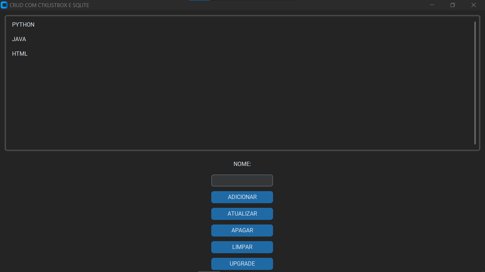
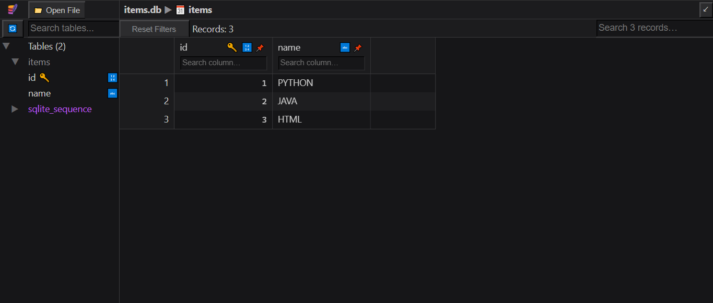

# CRUD COM CTKLISTBOX E SQLITE
👨‍🏫CRUD DE NOMES NA LISTA COM CUSTOMTKINTER E SQLITE.

 <br>
 <br>

## DESCRIÇÃO:
Este projeto implementa um aplicativo CRUD (Create, Read, Update, Delete) usando Python com SQLite como banco de dados e CustomTkinter (uma extensão personalizada do Tkinter) para a interface gráfica. A aplicação permite gerenciar uma lista de itens, onde você pode adicionar novos itens, atualizar itens existentes, excluí-los, e visualizar todos os itens na lista.

## FUNCIONALIDADES:
1. **Adicionar Item:**
   - Insira um nome no campo de entrada.
   - Clique no botão "ADICIONAR" para incluir o item na lista.
   - Um aviso será exibido se nenhum nome for inserido.

2. **Atualizar Item:**
   - Selecione um item na lista.
   - Modifique o nome no campo de entrada.
   - Clique no botão "ATUALIZAR" para salvar as alterações.
   - Um aviso será exibido se nenhum item estiver selecionado ou se nenhum nome for inserido.

3. **Excluir Item:**
   - Selecione um item na lista.
   - Clique no botão "APAGAR" para remover o item da lista.
   - Um aviso será exibido se nenhum item estiver selecionado.

4. **Listar Itens:**
   - Todos os itens do banco de dados são exibidos na `CTkListbox`.
   - Clique em qualquer item na lista para visualizar detalhes na seção "NOME".

5. **Limpar Campos:**
   - Clique no botão "LIMPAR" para limpar o campo de entrada e redefinir o rótulo "NOME".

6. **Atualizar Lista:**
   - Clique no botão "UPGRADE" para atualizar a `CTkListbox` com os itens mais recentes do banco de dados.

## EXECUTANDO ESSE PROJETO:
1. **Instalação das Dependências::**
   - Entre no diretório `CODIGO` e execute o comando:

   ```bash
   pip install -r requirements.txt
   ```

2. **Execução do Aplicativo:**
   - Para executar o arquivo Python, utilize o comando abaixo no terminal, dentro do diretório `./CODIGO`:
   ```bash
   python CODIGO.py
   ```

3. **Estrutura do Banco de Dados:**
   - O banco de dados SQLite `items.db` é criado automaticamente no diretório do script Python.
   - A tabela `items` é criada com dois campos: `id` (chave primária autoincrementável) e `name` (texto não nulo).

4. **Interagindo com o Aplicativo:**
   - Uma janela será aberta com a lista de itens e botões para adicionar, atualizar, excluir, limpar campos e atualizar a lista.
   - Selecione um item na lista para visualizar seus detalhes na seção "NOME".
   - Use os botões correspondentes para adicionar, atualizar, e excluir itens conforme necessário.

5. **Avisos e Mensagens:**
   - Avisos serão exibidos em uma janela pop-up (CTkToplevel) para alertas como inserção de nome vazio, nenhum item selecionado para atualização ou exclusão.

6. **Finalização do Aplicativo:**
   - Feche a janela do aplicativo para encerrar a execução.

## NÃO SABE?
- Entendemos que para manipular arquivos em muitas linguagens, é necessário possuir conhecimento nessas áreas. Para auxiliar nesse aprendizado, oferecemos cursos gratuitos disponíveis:
* [CURSO DE PYTHON](https://github.com/VILHALVA/CURSO-DE-PYTHON)
* [CURSO DE CUSTOMTKINTER](https://github.com/VILHALVA/CURSO-DE-CUSTOMTKINTER)
* [CURSO DE SQLITE](https://github.com/VILHALVA/CURSO-DE-SQLITE)
* [CURSO DE PYTHON COM SQLITE](https://github.com/VILHALVA/CURSO-DE-PYTHON-COM-SQLITE)
* [CONFIRA MAIS CURSOS](https://github.com/VILHALVA?tab=repositories&q=+topic:CURSO)

## CREDITOS:
- [PROJETO CRIADO PELO VILHALVA](https://github.com/VILHALVA)


